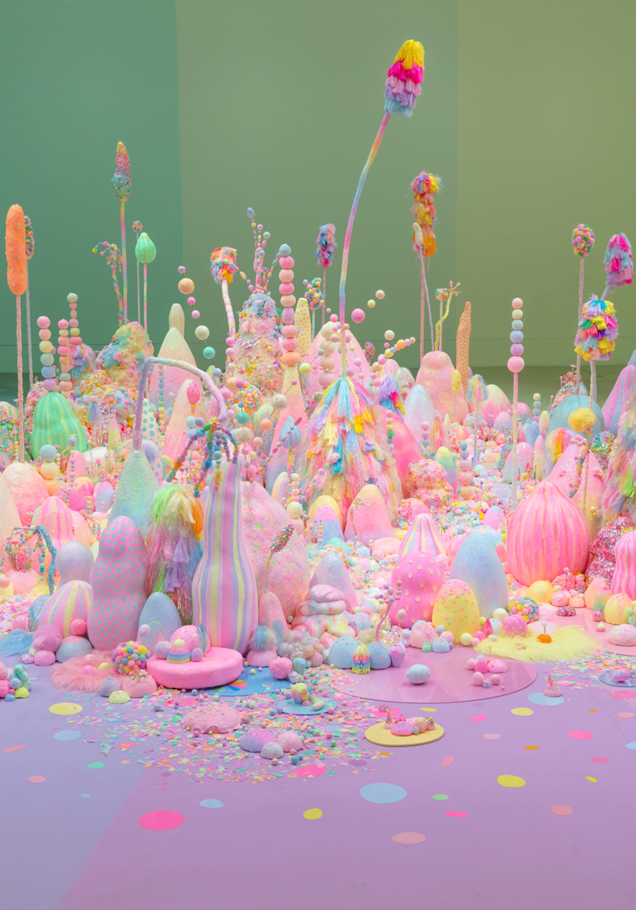
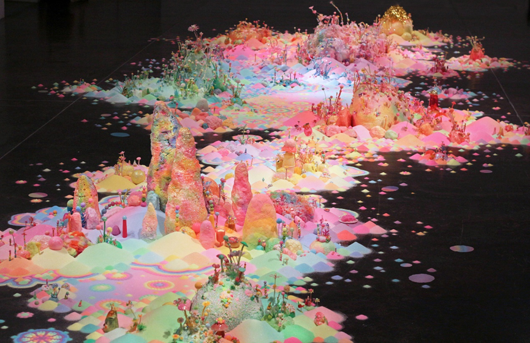

# jwan0961_9103_tut07

## Part 1: Imaging Technique Inspiration
The imaging technique inspiring for my assignment is from Tanya Schultz, also known as Pip & Pop. Tanya Schultz is known for her unique and intricate image techniques that create vibrant and dreamlike artworks. Her Sugar and Candy artworks contains imaging techniques such as miniature and microscopic details, the use of vibrant colours and patterns will help create the immersive visual experience that viewers appreciate. Therefore, I would like to incorporate this style into in my project.

