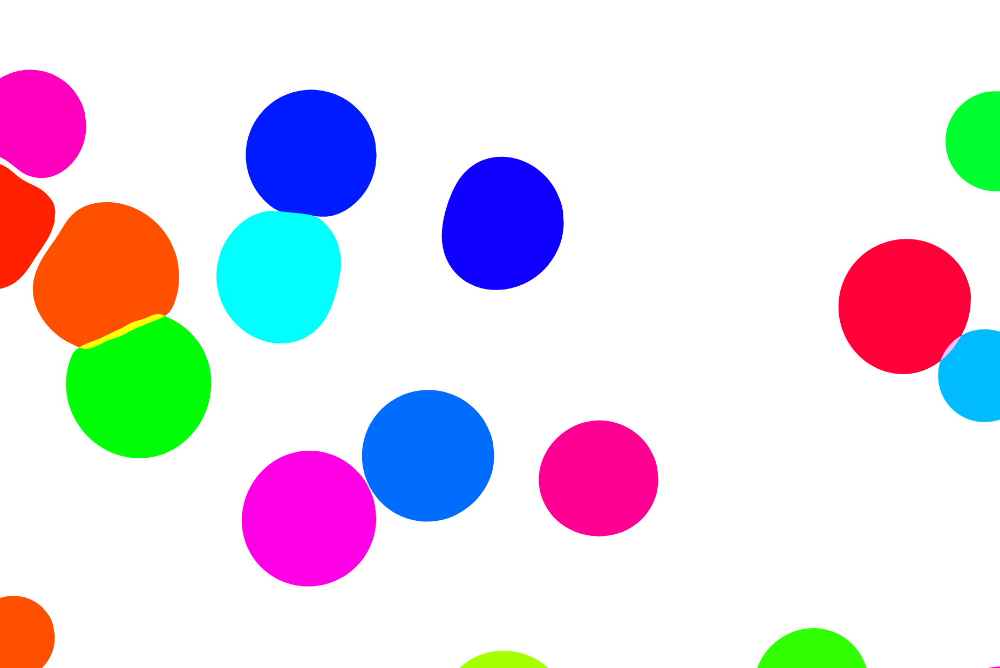

# jwan0961_9103_tut07

## Part 1: Imaging Technique Inspiration
The imaging technique inspiring for my assignment is from Tanya Schultz, also known as Pip & Pop. Tanya Schultz is known for her unique and intricate image techniques that create vibrant and dreamlike artworks. Her Sugar and Candy artworks contains imaging techniques such as miniature and microscopic details, the use of vibrant colours and patterns will help create the immersive visual experience that viewers appreciate. Therefore, I would like to incorporate this style into in my project.

*Tanya Schultz artwork: Kew Gardens*

*Tanya Schultz artwork: Galeria Libertad*

## Part 2: Coding Technique Exploration
According to recent research, potential coding techniques that could assist in implementing the imaging style in part 1 are from JavaScript packages [p5.js](https://p5js.org/) and [Paper.js](http://paperjs.org/).

In p5.js, function [Spring](https://p5js.org/examples/simulate-spring.html) can be used to create the reactions between patterns; function [Storing input](https://p5js.org/examples/input-storing-input.html) is able to be used for mouse tracking and interactions with patterns; function [Orbit Control](https://p5js.org/examples/3d-orbit-control.html) can be used to create 3D views. 

In Paper.js, functions in this package contribute to create the squeezing sensation after the collision of patterns and provide animation as well.

*Example of Spring in p5.js*

*Example of Storing Input in p5.js*

*Example from Paper.js*